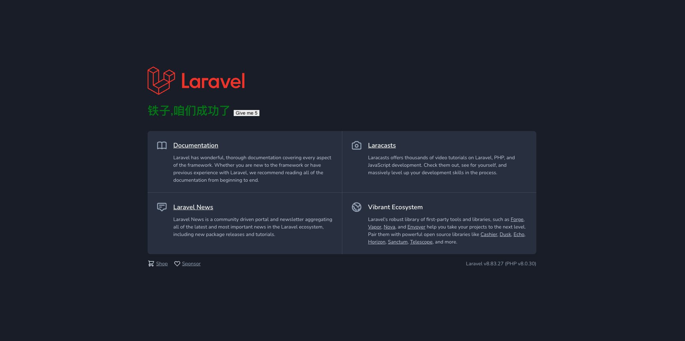

# wc-pr-docker 使用文档

## 环境准备
安装 [Docker](https://www.docker.com/) 和 [Docker-compose](https://github.com/docker/compose/releases)。

安装完成后可以使用各自的 `-v` 命令来检查是否安装成功。

```shell
$ docker -v
Docker version 24.0.5, build ced0996

$ docker-compose -v
Docker Compose version v2.20.2-desktop.1
```

## 快速开始

克隆[项目](https://github.com/wordcube-inc/wc-pr-api-docker)

```ssh
$ git clone https://github.com/wordcube-inc/wc-pr-api-docker.git
```

直接

```shell
$ docker-compose up
```

就完事了！

容器会以`php-fpm`的启动为结尾，当你看到如下控制台输出

```shell
NOTICE: fpm is running, pid 9
NOTICE: ready to handle connections
```

就说明启动完成了。

> 首次启动过程会比较漫长，php 所在的容器会自动执行为项目安装依赖等[动作](/wcprdocker/index.html#PHP 容器安装 composer 再安装项目依赖)。

打开浏览器访问：`http://localhost/8088`，查看页面是否正常显示。



到此为止，你已经成功启动了容器，可以前往工作目录 `./php/www` 开始编码了！


## 操作说明

### 服务启动

```shell
# 启动后在控制台可以看到输出
$ docker-compose up

# 在后台启动
$ docker-compose up -d
```

### 服务停止

```shell
# 仅停止容器
$ docker-compose down

# 停止容器并删除数据
$ docker-compose down -v
```

### 查看服务状态

打开 `Docker Desktop` 


点击左侧的 `Containers`，可以在右侧看到我们已经启动的服务容器。本项目的容器名是 `wc-pr-api`。在 `Status` 一列可以看到容器的运行状态。

## 更多配置

### Apache 配置

Apache 容器的 `/usr/local/apache2/conf` 目录已经被映射到项目目录下的 `./apache/config`，所以你可以直接在容器外修改 Apache 对应的配置。

| 文件                                    | 配置            |
| --------------------------------------- | --------------- |
| ./apache/config/httpd.conf              | apache 基础配置 |
| ./apache/config/extra/httpd-ssl.conf    | ssl 证书配置    |
| ./apache/config/extra/httpd-vhosts.conf | 虚拟主机配置    |

修改 Apache 配置后，需要重启 Apache 容器。前往 Docker Desktop，使用停止按钮来停止，再使用启动按钮来重启 Apache 容器。

### SSL 配置

> 待补充

### Mysql 默认配置

> Mysql 配置最好是在第一次启动服务之前修改！！

修改 `./docker-compose.yml`文件

```yml
MYSQL_ROOT_PASSWORD: root_password
MYSQL_DATABASE: your_database
MYSQL_USER: your_user
MYSQL_PASSWORD: your_password
```

修改为对应的值。

修改 `./php/www/.env`

```env
DB_PORT=3306
DB_DATABASE=your_database
DB_USERNAME=your_user
DB_PASSWORD=your_password
```

修改为和 `./docker-compose.yml` 中匹配的值。

> `.env` 文件中 DB_HOST 的值是不需要改的。在使用 docker-compose 编排的服务中，mysql 的 host 就是 mysql。

如果你已经启动过服务，并且 `./mysql/data` 中已经存在数据，需要先使用 Mysql 工具将用户名、数据库名、密码等手动修改好。因为即使你修改了 `docker-compose.yml` 文件后也重启了容器，也不会影响已经存在在 mysql 数据中的用户名和密码等数据。这时最简单便捷的方法就先导出数据，再删掉 `./mysql/data`中的数据，让 mysql 服务重新生成用户数据。

## 细节

### 容器启动顺序

根据 `docker-compose.yml` 中的 `depends_on` 字段，容器的启动顺序是：

1. mysql
2. php
3. apache

任意容器启动过程中出错，都会影响后续容器的启动。

### PHP 容器安装 composer 再安装项目依赖

容器初始化时，会基于 `./php/script/Dockerfile` 来创建 PHP 容器。此时会安装 `pdo_mysql` 扩展，来让项目获得对 mysql 的支持。

PHP 容器就绪后，会执行 `./php/script/init.sh` 脚本来进行服务的启动。这个脚本会：

1. 下载并安装 `composer`
2. 换 debian 源
3. 使用 apt 安装  `git` 和 `zip`
4. composer 换源
5. 初始化项目 `.env` 配置
6. 初始化 `php.ini`
7. 使用 composer 安装项目依赖
8. 生成应用 key
9. 启动 php-fpm

