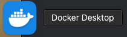
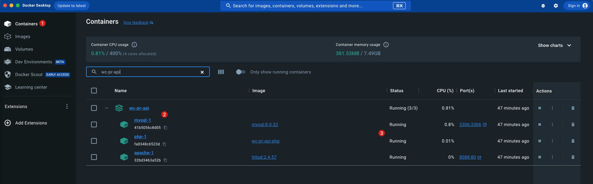

# 操作说明

## 服务启动

```shell
# 启动后在控制台可以看到输出
$ docker-compose up

# 在后台启动
$ docker-compose up -d
```

## 服务停止

```shell
# 仅停止容器
$ docker-compose down

# 停止容器并删除数据
$ docker-compose down -v
```

## 查看服务状态

打开 `Docker Desktop` 



点击左侧的 `Containers`，可以在右侧看到我们已经启动的服务容器。本项目的容器名是 `wc-pr-api`。在 `Status` 一列可以看到容器的运行状态。