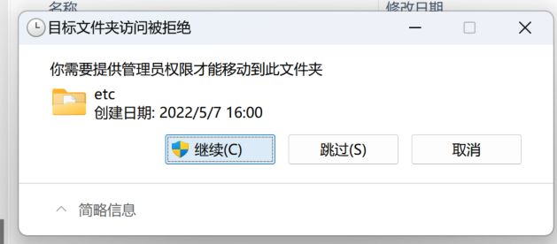

# 快速开始

:::danger 注意

如果在哪一步出现了问题，都请将项目恢复到初始状态重新进行。

因为排查问题的过程中可能会引入新的问题。
:::

## 克隆[项目](https://github.com/wordcube-inc/wc-pr-api-docker)

```shell
$ git clone https://github.com/wordcube-inc/wc-pr-api-docker.git
```

## 配置 hosts

windows 系统下编辑 `C:\Windows\System32\drivers\etc\hosts`
MacOS/Linux 系统下编辑 `/etc/hosts`

添加一行
```txt
127.0.0.1 newtac.local
```

::: warning 在 Windows 系统中
你需要管理员权限才能修改 hosts 文件。如果直接保存不成功，需要把 hosts 文件复制到其它目录（如桌面），编辑后保存，再粘贴回 `C:\Windows\System32\drivers\etc\hosts`。在文件夹视图中粘贴时会提示你使用管理员权限允许粘贴。


:::

保存 hosts 文件后需要刷新 dns。

:::tip MacOS
```shell
$ sudo killall -HUP mDNSResponder
```
:::

:::warning Windows
windows CMD
```shell
$ ipconfig /flushdns
```

windows powershell
```shell
$ Clear-DnsClientCache
```
:::

然后使用 ping 来测试是否配置成功。

::: tip MacOS
```shell
$ ping newtac.local
PING newtac.local (127.0.0.1): 56 data bytes
64 bytes from 127.0.0.1: icmp_seq=0 ttl=64 time=0.106 ms
64 bytes from 127.0.0.1: icmp_seq=1 ttl=64 time=0.172 ms
64 bytes from 127.0.0.1: icmp_seq=2 ttl=64 time=0.177 ms
^C
--- newtac.local ping statistics ---
3 packets transmitted, 3 packets received, 0.0% packet loss
round-trip min/avg/max/stddev = 0.106/0.152/0.177/0.032 ms
```
:::

::: warning Windows

```shell
PS V:\dockertest> ping newtac.local

正在 Ping newtac.local [127.0.0.1] 具有 32 字节的数据:
来自 127.0.0.1 的回复: 字节=32 时间<1ms TTL=128
来自 127.0.0.1 的回复: 字节=32 时间<1ms TTL=128

127.0.0.1 的 Ping 统计信息:
    数据包: 已发送 = 2，已接收 = 2，丢失 = 0 (0% 丢失)，
往返行程的估计时间(以毫秒为单位):
    最短 = 0ms，最长 = 0ms，平均 = 0ms
Control-C
```
:::

无论在哪个平台，只要显示 newtac.local 实际的 ip 地址是 `127.0.0.1`，则表示成功。

## 启动

```shell
$ docker-compose up
```

> 首次启动过程会比较漫长，php 所在的容器会自动执行为项目安装依赖等[动作](/wcprdocker/detail.html#php-容器安装-composer-再安装项目依赖)。

:::warning Windows
如果在 Windows 系统中运行 `docker-compose up` 后出现以下提示：

`error during connect: in the default daemon configuration on Windows, the docker client must be run with elevated privileges to connect: Get "http://%2F%2F.%2Fpipe%2Fdocker_engine/v1.24/containers/json?all=1&filters=%7B%22label%22%3A%7B%22com.docker.compose.config-hash%22%3Atrue%2C%22com.docker.compose.project%3Ddockertest%22%3Atrue%7D%7D": open //./pipe/docker_engine: The system cannot find the file specified.`

可能是因为你的 Docker Desktop 不是使用管理员权限运行的。在右下角找到 Docker Desktop 的图标，右键退出，再重新使用管理员权限启动 Docker Desktop 即可。
:::

## 信任证书

### MacOS 系统

::: tip MacOS
直接双击 `./apache/config/ssl/newtac.local.pem`，在弹出的 `钥匙串访问app` 中双击 `newtac.local` 项目，在弹出的窗口中选择 `信任` > `使用此证书时` > `始终信任`。
:::

### Windows 系统

::: warning Windows
1. 按下 Win + R 打开运行对话框。
输入 certmgr.msc 并按 Enter 打开证书管理器。

2. 在证书管理器中，展开 “受信任的根证书颁发机构” 节点，右键点击 "证书"。选择 "所有任务" > "导入"。选择证书文件 `./apache/config/ssl/newtac.local.pem`。
完成导入向导，确保将证书存储在 "个人" 存储区。

:::danger
如果点击“导入”后在 `ssl` 目录下看不到任何文件，需要点击右下角的下拉框显示“所有文件”。
:::


## 在 Chrome 中信任自签名证书

+ 在 Chrome 中，打开 chrome://flags。
+ 查找 "Insecure origins treated as secure"。
+ 将其设置为 "Enabled"。
+ 在 "Insecure origins" 输入框中添加你的本地开发域名: `https://newtac.local`。
+ 重新启动 Chrome。

## 验证

由于[容器的启动顺序]()，最后启动的一定是 `php-fpm`，启动完成后控制台会显示

```shell
dockertest-php-1     | [29-Jan-2024 06:05:54] NOTICE: fpm is running, pid 1149
dockertest-php-1     | [29-Jan-2024 06:05:54] NOTICE: ready to handle connections
```

打开浏览器访问：`https://newtac.local`，查看页面是否正常显示。


::: danger 提示
如果导入证书后浏览器还是访问不到 https 站点，可以尝试重启浏览器。
:::

:tada: 到此为止，你已经成功启动了容器，可以前往工作目录 `./php/www` 开始编码了！