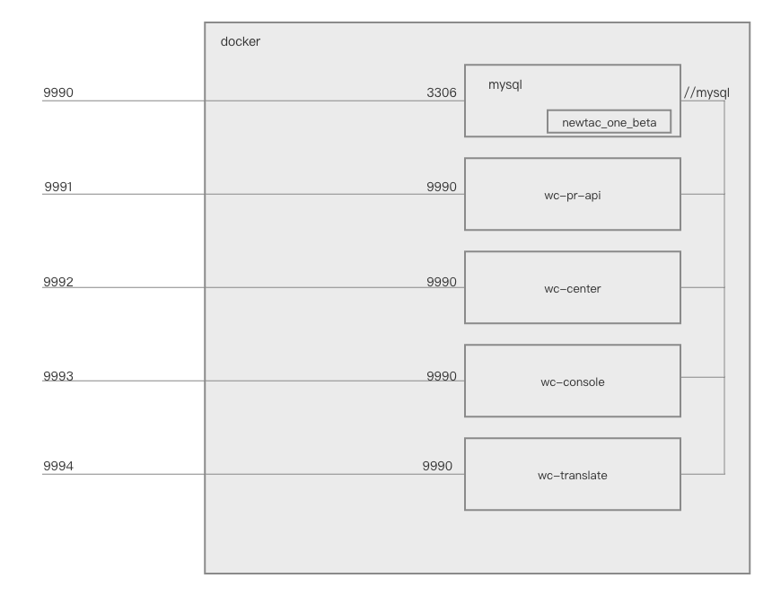

# 支持的仓库

> 如果后续开放了更多仓库的使用，会在这个页面更新。

| 仓库名 | 地址 | PHP版本 | 映射端口 |
| ------ | ---- | ------- | -------- |
|  wc-center      |   [https://github.com/wordcube-inc/wc-pr-api/wc-center](https://github.com/wordcube-inc/wc-pr-api/wc-center)     |   8.0      |    9992  |
|  wc-console      |   [https://github.com/wordcube-inc/wc-pr-api/wc-console](https://github.com/wordcube-inc/wc-pr-api/wc-console)     |   7.4      |    9993  |
|  wc-pr-api      |   [https://github.com/wordcube-inc/wc-pr-api/wc-pr-api](https://github.com/wordcube-inc/wc-pr-api/wc-pr-api)     |   7.4      |    9991  |
|  wc-translate      |   [https://github.com/wordcube-inc/wc-pr-api/wc-translate](https://github.com/wordcube-inc/wc-pr-api/wc-translate)     |   7.4      |    9994  |

除此之外，还开放了一个 mysql 服务，端口是 `9990`，你可以在宿主机上使用 mysql 可视化工具来访问它。mysql 服务的用户名和密码可以在 [`docker-compose.yml`](https://github.com/wordcube-inc/wc-pr-docker/blob/main/docker-compose.yml) 中查看。

整个 docker 的工作流程可以归纳为下图

